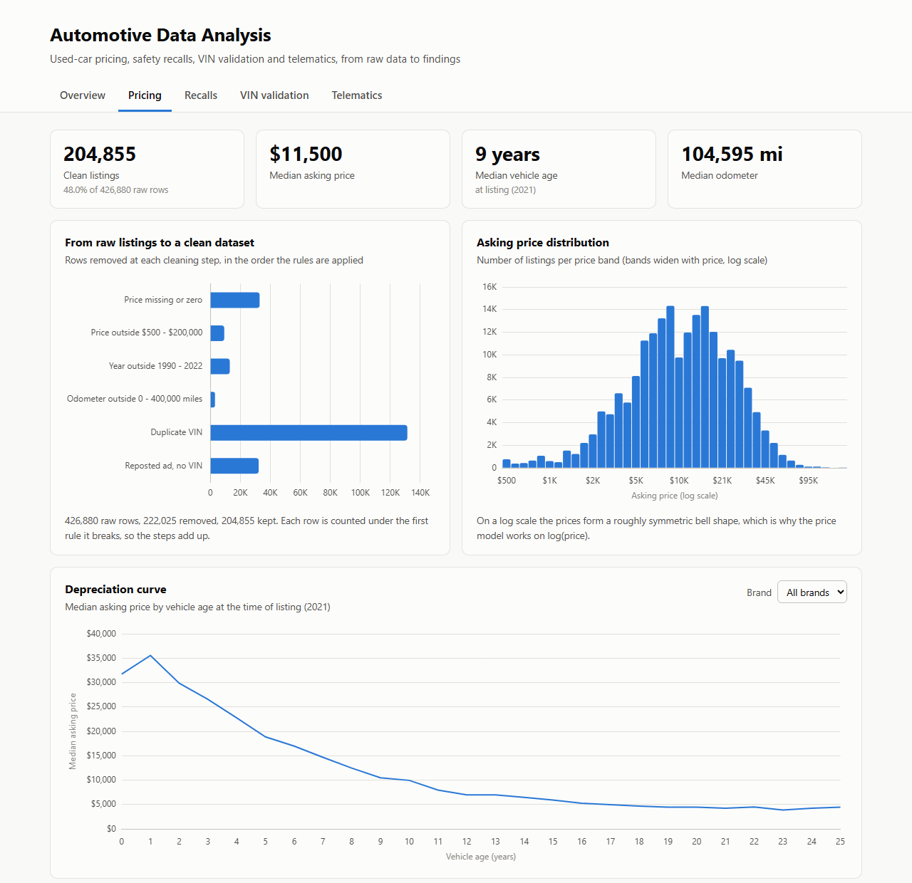

# Automotive Data Analysis

An end-to-end data analysis project on four real automotive datasets: used-car listings, NHTSA safety recalls, VIN decoder specifications and vehicle telematics. The project goes from raw files to cleaned datasets, analysis, and an interactive dashboard.



**Dashboard:** open [`docs/index.html`](docs/index.html) in a browser (it works directly from disk, no server needed).

## Key findings

| # | Finding | Evidence |
|---|---------|----------|
| 1 | More than a third of the raw listings are repeat postings | 30.8% of rows are the same VIN posted again and 7.6% are the same ad reposted without a VIN. 426,880 raw rows become 204,855 clean listings. |
| 2 | Vehicle age is the strongest price driver | Each extra year lowers the asking price by about 6.8% and every 10,000 miles by about 3.6%, with body type, fuel, drive and brand segment held fixed. Removing age drops the model's R² from 0.58 to 0.44. |
| 3 | Recall counts mostly measure manufacturer size | An RV maker is the 4th largest recall filer but 73rd by vehicles affected. Ranked by units, the list is led by the large passenger-car groups. |
| 4 | Fire-related recalls rank as the most severe | The severity proxy scored 100% of NHTSA "park outside" recalls and 70% of "do not drive" recalls as high severity, against 39% of all recalls. |
| 5 | A yes/no recall flag carries little information | 75.9% of the listed cars have at least one recall on record for their model and model year. The number of recalls is the more useful feature. |
| 6 | Sellers are accurate but leave gaps | In 1,000 decoded VINs the seller and the VIN disagreed in at most 2.1% of cases per field, while the decoder filled the drive type for 152 listings where it was empty. |

## Project stages

| Stage | Script | What it does |
|-------|--------|--------------|
| 1. Clean | `src/01_clean_listings.py` | Missing-value decisions, validity rules, de-duplication. Every removed row is counted under the rule that removed it. |
| 2. Price | `src/02_eda_pricing.py` | Price distribution, segment and brand analysis, feature engineering, log-price regression, feature importance and a robustness check. |
| 3. Recalls | `src/03_recalls_analysis.py` | Spikes and structural breaks per manufacturer, exposure bias, NMF topic model on recall text, keyword severity proxy validated against NHTSA advisories, three-level join to the listings with a coverage report. |
| 4. VIN | `src/04_vin_enrichment.py` | Decodes a random sample of 1,000 VINs with the NHTSA vPIC API (batched, cached, with retries), measures coverage, compares listing vs. decoder, applies validation rules and logs drop / correct / flag decisions. |
| 5. Telematics | `src/05_telematics.py` | Sampling-rate check, data quality report, trips rebuilt from timestamps, backward-looking window features and harsh-event rates per vehicle. |

Methodology, the data dictionary, feature definitions and limitations are in [`reports/analysis_notes.md`](reports/analysis_notes.md).

## Repository structure

```
├── src/                  analysis scripts (one per stage) and shared helpers
├── docs/                 the dashboard and report pages
│   ├── index.html        main dashboard (css/, js/)
│   ├── data_understanding_and_cleaning.html
│   ├── eda_feature_engineering_and_business_framing.html
│   ├── vehicle_recall_dashboard.html
│   ├── data/             numbers written by the scripts
│   └── figures/          charts written by the scripts
├── reports/
│   ├── analysis_notes.md methodology, definitions and limitations
│   └── tables/           summary tables written by the scripts
├── data/
│   ├── raw/              source files (not in the repository, see below)
│   └── processed/        cleaned datasets (not in the repository, rebuilt by the scripts)
└── requirements.txt
```

The dashboard reads its numbers from `docs/data/*.js`, which the scripts write. Nothing in the dashboard is typed in by hand.

## How to run

1. Install the dependencies (Python 3.9 or newer):

   ```bash
   pip install -r requirements.txt
   ```

2. Download the data into `data/raw/` (see the table below).

3. Run the stages in order, or all of them at once:

   ```bash
   python src/run_all.py
   ```

   Each stage can also be run on its own, for example `python src/02_eda_pricing.py`. Stage 2, 3 and 4 need the output of stage 1.

4. Open `docs/index.html`.

The full run takes a few minutes. Stage 1 reads a 1.4 GB file and needs about 2 GB of free memory. Stage 4 calls the NHTSA API once and caches the responses under `data/raw/vin_cache/`, so later runs work offline.

## Data sources

The raw files are too large for GitHub and are not redistributed here.

| File in `data/raw/` | Source | Downloaded |
|---------------------|--------|------------|
| `vehicles.csv` | Kaggle, [Craigslist Cars & Trucks](https://www.kaggle.com/datasets/austinreese/craigslist-carstrucks-data) by Austin Reese | 13 Jan 2026 |
| `recalls.csv` | [NHTSA recalls](https://www.nhtsa.gov/recalls) data export | 31 Jan 2026 |
| `telematics.csv` | [Vehicle Telematics OBD-II dataset](https://github.com/mukul-bhele/vehicletelematics) | 2026 |
| (API) | [NHTSA vPIC](https://vpic.nhtsa.dot.gov/api/) VIN decoder, called by stage 4 | 3 Oct 2026 |

## Limitations

- **Asking prices, not sale prices.** Listings reflect what sellers hope to get. All price results describe asking prices.
- **Correlation, not causation.** The regression effects are associations. For example, the diesel premium is partly a heavy-duty truck effect.
- **The price model is a baseline.** R² = 0.58 on log price, with a typical error of 25% of the asking price. Condition, trim level and options are mostly missing from the data.
- **Recall join.** Model years can only be read from recall descriptions written after about 2005, and model names are matched on the first word of the listing's model. Truck, bus, trailer and RV recalls have no counterpart in the listings.
- **Severity proxy.** It is keyword based and depends on how the manufacturer phrased the summary. It is a triage aid, not a safety assessment.
- **VIN sample.** 1,000 VINs out of about 100,000 listings that include a valid VIN. Listings without a VIN may differ.
- **Telematics.** Eight vehicles over six weeks, and the source file is cut at the Excel row limit, so the results describe this sample only.

## Tools

Python (pandas, NumPy, scikit-learn, matplotlib, seaborn, requests), Chart.js for the dashboard.

Generative AI tools were used as a coding and review assistant during the project. The analysis decisions, checks and conclusions were verified against the data.
